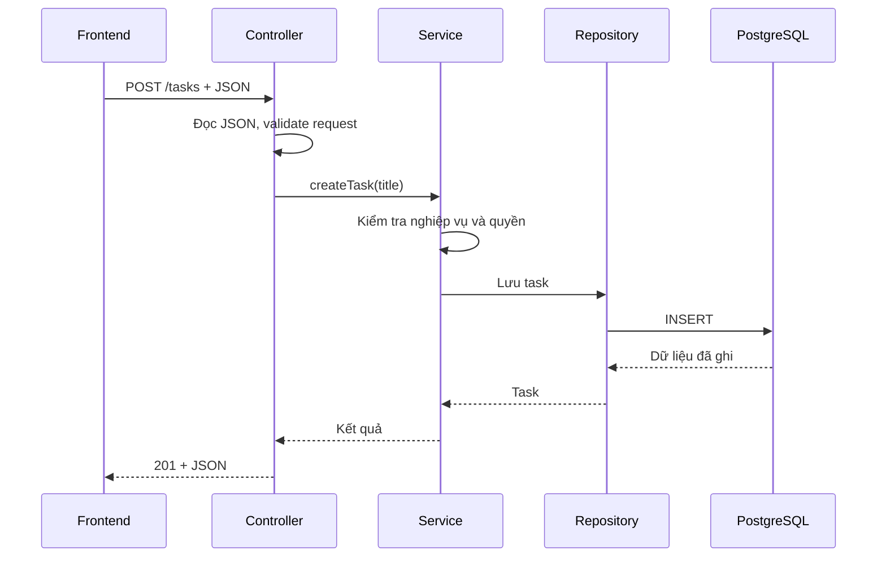

# Backend Nhận Request Và Chịu Trách Nhiệm Gì?

**Học ở tuần 6 mới.** Bạn đã có class Task và service Java thuần. Bài này nối nghiệp vụ đó với browser; chưa cần Spring annotation để hiểu luồng.

## 1. Ý chính

Backend là chương trình nhận request, kiểm tra dữ liệu và quyền, thực hiện nghiệp vụ rồi trả response. Database giữ dữ liệu lâu dài; server vẫn phải kiểm soát ai được thao tác gì. Một chức năng FE quen thuộc như “thêm task” trở thành một giao dịch có thể lỗi ở nhiều bước.



Ở giai đoạn đầu repository dùng bộ nhớ, chưa có PostgreSQL. Đường đi qua controller/service vẫn tương tự.

## 2. Giải thích request/response

Ví dụ contract, chưa phải endpoint đã có sẵn:

```http
POST /tasks HTTP/1.1
Host: localhost:8080
Content-Type: application/json

{"title":"Học Java"}
```

```http
HTTP/1.1 201 Created
Content-Type: application/json
Location: /tasks/1

{"id":1,"title":"Học Java","status":"TODO"}
```

`POST` là method, `/tasks` là đường dẫn resource, header mô tả request, body mang dữ liệu. `201` báo đã tạo resource; `Location` chỉ địa chỉ resource đó. JSON không phải Java object: framework phải chuyển JSON thành object và có thể thất bại trước khi gọi service.

Sau khi làm API ở tuần 7–8, kiểm tra bằng:

```sh
curl -i -X POST http://localhost:8080/tasks   -H 'Content-Type: application/json'   -d '{"title":"Học Java"}'
```

| Tình huống của project | Response quy ước |
| --- | --- |
| Đọc task thành công | 200 + dữ liệu |
| Tạo task thành công | 201 + dữ liệu và Location |
| Xóa thành công | 204, không có body |
| JSON sai hoặc title không hợp lệ | 400 + lỗi rõ nghĩa |
| Chưa đăng nhập khi gọi endpoint riêng tư | 401 |
| Đăng nhập rồi nhưng không có quyền | 403; project có thể dùng 404 để không tiết lộ resource |
| Task không tồn tại | 404 |
| Xung đột cập nhật/version | 409 |
| Lỗi server ngoài dự kiến | 500, thông báo chung cho client; chi tiết ở log |

Đây là contract chọn cho bài tập, không phải mọi API đều dùng duy nhất bảng này. Dùng status nhất quán để FE biết hiển thị hay thử lại ra sao.

## 3. Vì sao thiết kế như vậy

Ví dụ sai: FE đã chặn title rỗng nên backend chỉ lưu bất kỳ body nào nhận được. Người dùng có thể gửi `curl` hoặc sửa request để bỏ qua FE. Backend phải validate lại input và DB nên có constraint cho quy tắc dữ liệu quan trọng.

Một lỗi khác: FE timeout rồi gửi lại `POST`; request đầu có thể đã lưu thành công, gây hai task. Timeout không chứng minh server chưa làm gì. Bài cơ bản cần hiểu tình huống; cơ chế chống tạo trùng bằng idempotency key là mở rộng.

## 4. Liên hệ với frontend

Bạn đã từng viết loading/error UI. Bây giờ hãy truy ngược lỗi: request chưa tới server, JSON không parse được, service từ chối nghiệp vụ hay DB không kết nối được? Tab Network cho thấy request và response; server log giải thích chuyện xảy ra phía sau response đó.

HTTP stateless nghĩa là mỗi request có ngữ nghĩa độc lập; ứng dụng vẫn có thể dùng session/cookie để liên hệ các request với một người dùng. Session không biến state trong browser thành nguồn dữ liệu đáng tin cho backend.

## 5. Khi nào dùng và không dùng

Dùng GET để đọc; đừng tạo/xóa dữ liệu nghiệp vụ qua GET. Dùng PUT khi contract là thay thế resource; PATCH khi cập nhật một phần. Idempotent nghĩa là gửi lặp cùng yêu cầu có cùng tác động dự kiến, không bắt buộc status/body mỗi lần giống nhau.

CORS là cơ chế browser kiểm soát việc frontend khác origin đọc response. Nó không phải authentication và không chặn curl. Khi FE/API khác origin, học preflight và cấu hình origin được phép; khi dùng cookie đăng nhập, học thêm CSRF trong chặng bảo mật.

## 6. Bẫy hay gặp

- Trả 200 cho mọi lỗi khiến FE không phân biệt thất bại.
- Đưa password/token hoặc stack trace vào response/log.
- Tin `ownerId` do client gửi là người đang đăng nhập.
- Giữ “current user” trong field của singleton service: request người khác có thể ghi đè.
- Nghĩ đổi HashMap thành ConcurrentHashMap làm mọi nghiệp vụ nhiều bước tự atomic.

## 7. Thuật ngữ mới

- **Endpoint**: một điểm gọi API, xác định bởi method và đường dẫn.
- **DTO**: object vận chuyển dữ liệu qua ranh giới API, không nhất thiết trùng entity DB.
- **Persistence**: lưu dữ liệu để còn tồn tại sau khi chương trình dừng.
- **Origin**: tổ hợp scheme, host, port.
- **Validation**: kiểm tra input; **authorization**: kiểm quyền thao tác.

## 8. Bài tập nhỏ để tự làm

Viết `api-contract.md` cho tạo/lấy/xóa task: request, response thành công, title blank, ID không tồn tại. Chỉ định giới hạn title 100 ký tự và schema lỗi gồm `code`, `message`, `fieldErrors`. Sau khi có API, gọi cả input hợp lệ lẫn lỗi bằng curl; đối chiếu contract.

Tiếp theo: [IoC/DI](../phase-06-spring-boot-core/week-13/01-ioc-di-bean-autoconfiguration.md), sau đó [SQL trước JPA](02-sql-before-jpa.md). Tra cứu mô hình giao thức tại [MDN HTTP overview](https://developer.mozilla.org/en-US/docs/Web/HTTP/Guides/Overview).
